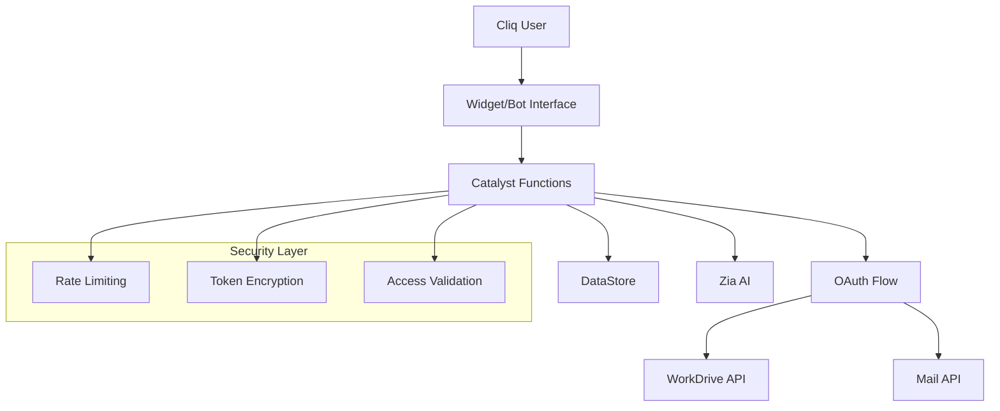

# DocDex - AI-Powered Document Search for Zoho Cliq 🔍

[](https://cliq.zoho.com)
[](https://catalyst.zoho.com)
[](https://zia.zoho.com)
[](https://opensource.org/licenses/MIT)

DocDex is a powerful Zoho Cliq extension that brings AI-powered document indexing and search capabilities to your team. Seamlessly integrate with WorkDrive and Mail to create a unified, intelligent document discovery experience.

## ✨ Key Features

### 🤖 AI-Powered Intelligence
- **Smart Summarization**: Zia AI generates concise document summaries
- **Entity Extraction**: Automatically identify people, places, and concepts
- **Keyword Analysis**: Extract relevant topics and themes
- **Natural Language Search**: Search using conversational queries

### 🔗 Seamless Integration  
- **WorkDrive Files**: Index and search all your team documents
- **Email Attachments**: Discover attachments from Mail conversations
- **OAuth Security**: Secure, permission-based access to your data
- **Real-time Sync**: Background indexing keeps content up-to-date

### 💬 Multiple Interfaces
- **Interactive Widget**: Rich sidebar experience with filters and previews
- **Bot Commands**: Conversational search via `/doc` commands
- **Quick Actions**: Save to tasks, download files, generate summaries
- **Mobile Ready**: Responsive design works on any device

### 🛡️ Enterprise Security
- **Token Encryption**: All OAuth tokens encrypted at rest
- **Access Control**: User-based permissions and organization isolation
- **Rate Limiting**: Built-in protection against abuse
- **Audit Logging**: Complete activity tracking

## 🚀 Quick Start

### 1. Prerequisites Setup
Ensure you have access to:
- Zoho Catalyst (for backend deployment)
- Zoho Cliq Developer Console (for extension publishing)
- Zoho OAuth credentials (for WorkDrive/Mail access)
- Zia Skills API key (for AI features)

### 2. One-Click Deploy
```bash
# Clone repository
git clone https://github.com/your-org/docdex.git
cd docdex

# Deploy to Catalyst
catalyst init DocDex
cp catalyst/functions/* your-catalyst-project/functions/
catalyst deploy

# Configure secrets
catalyst secrets set ZOHO_CLIENT_ID "your_client_id"
catalyst secrets set ZOHO_CLIENT_SECRET "your_client_secret"
catalyst secrets set OPENAI_API_KEY "your_openai_key"
catalyst secrets set OPENAI_MODEL "gpt-4-turbo"
```

### 3. Install Extension
```bash
cd cliq-extension
zip -r docdex-extension.zip .
# Upload to Cliq Developer Console at cliq.zoho.com/developer
```

### 4. Start Using
1. Install extension in your Cliq organization
2. Use `/doc-auth` to authorize access
3. Search documents with `/doc search quarterly reports`
4. Explore the widget for advanced features

## 📖 User Guide

### Bot Commands Reference

| Command | Description | Example |
|---------|-------------|---------|
| `/doc search <query>` | Search documents | `/doc search project timeline` |
| `/doc-auth` | Authorize DocDex | `/doc-auth` |
| `/doc-status` | Check connection status | `/doc-status` |
| `/doc-summary <filename>` | Get AI summary | `/doc-summary report.pdf` |

### Widget Features

- **Smart Search**: Natural language queries with instant results
- **Advanced Filters**: Filter by source (WorkDrive/Mail), file type, date
- **Preview Mode**: View summaries without downloading files  
- **Bulk Actions**: Select multiple files for batch operations
- **Recent Activity**: Quick access to recently accessed documents

### Search Tips

- Use descriptive terms: "quarterly financial report 2024"
- Include file types: "presentation about marketing strategy"
- Search by sender: documents from "john.doe@company.com"
- Use date ranges: files from "last month"

## 🏗️ Technical Architecture

### System Components



### Function Architecture

| Function | Purpose | Trigger |
|----------|---------|---------|
| `startOAuth` | Initiate authorization | User request |
| `oauthCallback` | Handle OAuth response | Redirect |
| `indexWorkdrive` | Background document indexing | Scheduled/Manual |
| `searchDocs` | Search and filter documents | User query |
| `summarizeDocument` | Generate AI summaries | User request |
| `fetchFileProxy` | Secure file downloads | File access |

### Data Flow

1. **Authentication**: User authorizes via OAuth → tokens encrypted and stored
2. **Indexing**: Background jobs scan WorkDrive/Mail → metadata stored in DataStore  
3. **Search**: User queries → intelligent matching → ranked results returned
4. **Summarization**: File content → Zia AI processing → summary stored
5. **Access**: Permission-validated file downloads → secure proxy delivery

## 🔧 Configuration

### Required Environment Variables

```bash
# OAuth Configuration
ZOHO_CLIENT_ID=your_oauth_client_id
ZOHO_CLIENT_SECRET=your_oauth_client_secret
ZOHO_REDIRECT_URI=https://your-app.catalyst.zoho.com/oauthCallback

# AI Services (OpenAI)
OPENAI_API_KEY=your_openai_api_key
OPENAI_MODEL=gpt-4-turbo

# Security
TOKEN_ENCRYPTION_KEY=random_32_character_key

# Optional: Customization
DEFAULT_SEARCH_LIMIT=20
MAX_FILE_SIZE_MB=50
INDEXING_SCHEDULE=0_*/6_*_*_*
```

### DataStore Tables

| Table | Purpose | Key Fields |
|-------|---------|------------|
| `user_tokens` | OAuth tokens | `user_id`, `access_token`, `refresh_token` |
| `documents` | File metadata | `file_id`, `name`, `source_type`, `mime_type` |
| `document_summaries` | AI summaries | `document_id`, `summary_text`, `entities` |
| `authorized_users` | User permissions | `user_id`, `org_id`, `authorized_at` |
| `oauth_states` | Temporary states | `state`, `expires_at` |

## 🧪 Testing & Development

### Postman Testing
Import the provided Postman collection for comprehensive API testing:

```bash
# Collection location
tests/postman_collection.json

# Required variables
CATALYST_BASE_URL=https://your-app.catalyst.zoho.com
CLIQ_USER_ID=test_user_123
CLIQ_ORG_ID=test_org_456
```

### Local Development

```bash
# Install dependencies
npm install

# Start local development
catalyst serve

# Watch for changes
catalyst watch

# Run tests
npm test
```

### Testing Checklist

- [ ] OAuth flow completion
- [ ] Document indexing (WorkDrive + Mail)
- [ ] Search functionality with filters
- [ ] AI summarization
- [ ] File downloads
- [ ] Bot command responses
- [ ] Widget interface
- [ ] Error handling
- [ ] Rate limiting
- [ ] Security validation

## 📊 Monitoring & Analytics

### Key Metrics
- **User Adoption**: Active users, authorization rate
- **Content Growth**: Documents indexed, processing success rate
- **Usage Patterns**: Search frequency, popular queries
- **Performance**: Response times, error rates

### Monitoring Tools
- Catalyst function logs and metrics
- Custom dashboard via DataStore queries
- Integration with external monitoring (optional)

### Alerts
- Failed indexing jobs
- High error rates
- Rate limit violations
- Storage quota warnings

## 🔒 Security Best Practices

### Data Protection
✅ All tokens encrypted with AES-256  
✅ Secrets managed via Catalyst vault  
✅ No sensitive data in logs  
✅ Regular token rotation  
✅ User data isolation by organization

### Access Control  
✅ OAuth scope-based permissions  
✅ Request validation and sanitization  
✅ Rate limiting per user/endpoint  
✅ Audit logging for compliance  
✅ File access permission checking

### Development Security
✅ No hardcoded secrets in source code  
✅ Input validation and sanitization  
✅ HTTPS enforcement  
✅ Content Security Policy  
✅ Regular dependency updates

## 📈 Scaling & Performance

### Optimization Features
- **Caching**: Search results and summaries cached for faster access
- **Pagination**: Large result sets split into manageable pages
- **Background Processing**: Indexing runs asynchronously 
- **Database Indexing**: Optimized queries for fast search
- **CDN**: Static assets served via CDN

### Scaling Considerations
- Horizontal scaling via Catalyst auto-scaling
- Database query optimization for large datasets
- File storage and transfer optimization
- API rate limit management
- Memory usage optimization for large files

## 🛠️ Customization

### Branding
- Update extension name and description in `manifest.json`
- Replace icons in `cliq-extension/icons/`
- Customize colors in `widget.css`
- Modify bot responses in `bot.js`

### Features
- Add new file type support in `utilities.js`
- Customize search algorithms in `searchDocs.js`
- Extend AI processing in `summarizeDocument.js`
- Add new bot commands in `bot.js`

### Integration
- Connect with external systems via webhook
- Add custom data sources beyond WorkDrive/Mail
- Integrate with task management tools
- Export capabilities for search results

## 🤝 Contributing

We welcome contributions! Please see our [Contributing Guidelines](CONTRIBUTING.md) for details.

### Development Setup
1. Fork the repository
2. Create a feature branch
3. Make your changes with tests
4. Submit a pull request

### Reporting Issues
- Use GitHub Issues for bug reports
- Include reproduction steps
- Provide error logs and environment details
- Suggest improvements or feature requests

## 📚 Resources

### Documentation
- [Complete Deployment Guide](docs/deployment_guide.md)
- [API Reference](docs/api_reference.md)  
- [User Manual](docs/user_guide.md)
- [Troubleshooting](docs/troubleshooting.md)

### External Links
- [Catalyst Documentation](https://catalyst.zoho.com/docs)
- [Cliq Extensions Guide](https://cliq.zoho.com/developer/docs)
- [Zia Skills API](https://zia.zoho.com/help/api/)
- [OAuth Documentation](https://www.zoho.com/developer/help/api/)

### Community
- [GitHub Discussions](https://github.com/your-org/docdex/discussions)
- [Zoho Developer Community](https://help.zoho.com/portal/en/community/)
- [Stack Overflow](https://stackoverflow.com/questions/tagged/zoho)

## 📄 License

This project is licensed under the MIT License - see the [LICENSE](LICENSE) file for details.

## 🎯 Roadmap

### Version 2.0 (Planned)
- [ ] Advanced semantic search with vector embeddings
- [ ] Multi-language support and translation
- [ ] Collaborative features (shared searches, comments)
- [ ] Advanced analytics dashboard
- [ ] Integration with more Zoho services
- [ ] Mobile app with offline capabilities

### Future Enhancements
- [ ] Machine learning for personalized search results
- [ ] Advanced document comparison tools
- [ ] Workflow automation triggers
- [ ] External storage providers support
- [ ] Advanced security features (DLP, watermarking)

## 👥 Team & Support

### Maintainers
- **Core Team**: [@your-team](https://github.com/your-team)
- **Community**: [@contributors](https://github.com/your-org/docdex/contributors)

### Getting Help
1. Check the [documentation](docs/)
2. Search [existing issues](https://github.com/your-org/docdex/issues)
3. Create a [new issue](https://github.com/your-org/docdex/issues/new)
4. Join the [community discussions](https://github.com/your-org/docdex/discussions)

### Commercial Support
For enterprise support, custom development, and SLA agreements, contact us at [support@your-company.com](mailto:support@your-company.com).

---

**Built with ❤️ by the DocDex Team**

*Making document discovery effortless in the modern workplace.*